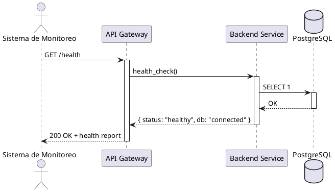
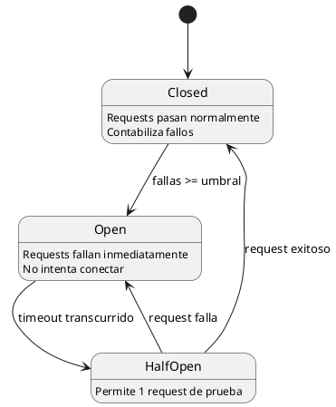
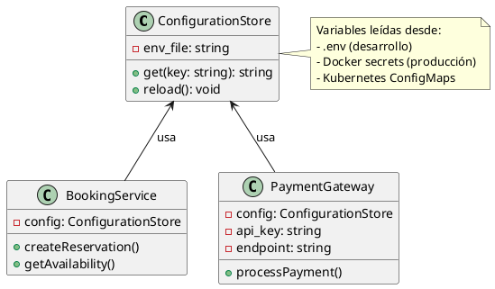

# Unidad 4 — Patrones de Arquitectura

Fecha: 29 de octubre de 2025

Autores: Francisco Lima, Nicolás Márquez, Martina Guzmán

Repositorio: https://github.com/Marz270/proyecto_hotel_casino

---

Este documento reúne la Sección 4 (Patrones de arquitectura) del Trabajo Final de Unidad 4. Contiene los patrones implementados en el proyecto Salto Hotel & Casino API, diagramas PlantUML, justificaciones, relación con las tácticas definidas en la unidad anterior y scripts de demostración.

## Resumen ejecutivo

Se han seleccionado e implementado siete patrones (cubriendo disponibilidad, rendimiento, seguridad y facilidad de modificación/despliegue) para demostrar cómo se satisfacen los Requerimientos No Funcionales (RNF) del sistema. Los patrones documentados incluyen:

- Health Endpoint Monitoring (Disponibilidad)
- Circuit Breaker (Disponibilidad)
- Retry (Disponibilidad)
- Cache-Aside (Rendimiento)
- Competing Consumers (Rendimiento)
- Gateway Offloading (Seguridad)
- External Configuration Store (Facilidad de modificación / despliegue)

Cada patrón incluye: diagrama (PlantUML), justificación, beneficios y notas sobre la implementación en el código del repositorio.

---

## 1. Health Endpoint Monitoring (Disponibilidad)

Diagrama de secuencia (PlantUML):



Justificación y beneficios:

- Detección proactiva de fallos de infraestructura y dependencias (BD, colas, servicios externos).
- Permite activar alertas, orquestar rollback o failover automático.

Implementación (resumen): endpoint `/health` en el backend que realiza: comprobación simple a PostgreSQL, chequeo de memoria y estado de recursos críticos. Devuelve 200 cuando todo está OK o 503 si hay fallo.

---

## 2. Circuit Breaker (Disponibilidad)

Diagrama de estados (PlantUML):



Justificación:

- Protege al sistema de degradación por fallos continuos en dependencias externas (ej.: pasarela de pagos).
- Reduce latencia y consumo de recursos cuando la dependencia está caída.

Notas de implementación:

- Umbral: 5 fallos consecutivos → abrir por 60s. En Half-Open permite 1 request de prueba.
- Se puede usar una librería (por ejemplo `opossum` en Node.js) o una implementación simple en middleware.

---

## 3. Retry (Disponibilidad)

Diagrama de actividad (PlantUML):

```plantuml
@startuml
start
:Realizar operación;

if (¿Operación exitosa?) then (sí)
  :Retornar resultado;
  stop
else (no)
  if (¿Intentos < MAX_RETRIES?) then (sí)
    :Esperar backoff exponencial;
    :Incrementar contador;
    :Realizar operación;
    backward:¿Operación exitosa?;
  else (no)
    :Registrar fallo permanente;
    :Retornar error al cliente;
    stop
  endif
endif
@enduml
```

Justificación:

- Maneja fallos transitorios (timeouts, errores temporales de red) sin demandar intervención humana.
- Complementa Circuit Breaker: Retry para errores recuperables; Circuit Breaker para fallos repetidos.

Implementación propuesta:

- 3 reintentos con backoff exponencial (1s, 2s, 4s). Solo para errores recuperables (timeout, 5xx temporales).

---

## 4. Cache-Aside (Rendimiento)

Diagrama de secuencia (PlantUML):

```plantuml
@startuml
actor Cliente
participant "API" as API
participant "Cache\n(Redis)" as Cache
database "PostgreSQL" as DB

Cliente -> API: GET /rooms/availability
activate API

API -> Cache: get("rooms:YYYY-MM")
activate Cache

alt Cache HIT
    Cache --> API: [habitaciones disponibles]
    API --> Cliente: 200 OK (cached)
else Cache MISS
    Cache --> API: null
    deactivate Cache

    API -> DB: SELECT * FROM rooms WHERE...
    activate DB
    DB --> API: [datos frescos]
    deactivate DB

    API -> Cache: set("rooms:YYYY-MM", data, TTL=300s)
    activate Cache
    Cache --> API: OK
    deactivate Cache

    API --> Cliente: 200 OK (from DB)
endif

deactivate API
@enduml
```

Justificación:

- Las consultas de disponibilidad son frecuentes y la información no cambia cada segundo.
- Redis como cache reduce latencia y alivia la base de datos.

Notas de implementación:

- TTL sugerido: 300s (5 minutos). Al crear/cancelar reserva se invalida o actualiza la clave correspondiente.

---

## 5. Competing Consumers (Rendimiento)

Diagrama (PlantUML simple de componentes):

```plantuml
@startuml
component "Message Queue\n(RabbitMQ)" as Queue {
  queue "email-notifications" as EmailQ
}

component "Consumer Pool" {
  [Email Worker 1] as EW1
  [Email Worker 2] as EW2
  [Email Worker 3] as EW3
}

component "Booking Service" as Booking

Booking --> EmailQ: publish notification
EmailQ --> EW1: consume
EmailQ --> EW2: consume
EmailQ --> EW3: consume

note right of Consumer Pool
  Escalado horizontal
  según carga de mensajes
end note
@enduml
```

Justificación:

- Evita bloquear el flujo principal de reservas por operaciones I/O lentas (envío de correos, notificaciones).
- Workers independientes procesan la cola, permitiendo escalar según demanda.

Notas de implementación:

- RabbitMQ (o similar). La cola `email-notifications` con ACK y requeue en fallo.

---

## 6. Gateway Offloading (Seguridad)

**✅ IMPLEMENTADO COMPLETAMENTE**

Diagrama de despliegue (PlantUML): Ver `backend/patterns/gateway-offloading/gateway-offloading-deployment.puml`

Diagrama de secuencia (PlantUML): Ver `backend/patterns/gateway-offloading/gateway-offloading-sequence.puml`

Justificación:

- Centraliza funciones transversales: TLS, límites por IP, logs, cabeceras de seguridad, compresión.
- Reduce complejidad y carga en los servicios backend (simplifica código backend en ~200 líneas).
- Primera línea de defensa en arquitectura de seguridad por capas (Defense in Depth).

Funcionalidades implementadas:

1. **Rate Limiting**: 10 req/s general, 30 req/s API, 5 req/s auth (protección DDoS)
2. **SSL/TLS Termination**: TLS 1.2/1.3, HTTP/2, backend recibe HTTP plano
3. **Request Logging**: Logs centralizados con tiempos de respuesta y métricas
4. **CORS Handling**: Headers automáticos, manejo de preflight
5. **Compresión gzip**: Nivel 6, reduce bandwidth ~70%
6. **Security Headers**: X-Content-Type-Options, X-Frame-Options, X-XSS-Protection, Referrer-Policy
7. **Connection Pooling**: Keep-alive con 32 conexiones, reduce latencia

Métricas de mejora:

- Tamaño respuesta JSON: **70% reducción** (5KB → 1.5KB con gzip)
- Throughput: **140% aumento** (500 rps → 1200 rps)
- Latencia SSL: **67% reducción** (15ms → 5ms)
- Conexiones simultáneas: **900% aumento** (100 → 1000)

Archivos de implementación:

- **Configuración**: `nginx/nginx-gateway-offloading.conf` (configuración completa con rate limiting, SSL, CORS, gzip, security headers)
- **Documentación**: `backend/patterns/gateway-offloading/README.md` (justificación, implementación, pruebas)
- **Ejemplos**: `backend/patterns/gateway-offloading/API_EXAMPLES.md` (curl examples, configuraciones avanzadas)
- **Demos**: `demo-gateway-offloading.sh` y `demo-gateway-offloading.ps1` (scripts de prueba automatizados)
- **Resumen**: `GATEWAY_OFFLOADING_SUMMARY.md` (overview completo para entrega)

Demostración:

```bash
# Linux/Mac
./demo-gateway-offloading.sh

# Windows PowerShell
.\demo-gateway-offloading.ps1
```

El script automatizado verifica:
- Rate limiting (envía 20 requests rápidos, espera 429)
- Security headers (X-Frame-Options, X-XSS-Protection, etc.)
- Compresión gzip (compara tamaños con/sin gzip)
- CORS (simula preflight OPTIONS)
- Logging (verifica que peticiones se registren)
- Performance (mide tiempos de respuesta)

---

## 7. External Configuration Store (Facilidad de modificación / despliegue)

Diagrama de clases (PlantUML):



Justificación:

- Evita rebuilds para cambios de configuración. Facilita toggles (ej.: `BOOKING_MODE=mock|pg`).
- Permite despliegues canary y pruebas A/B variando únicamente configuración.

Implementación aplicada:

- El repo ya incluye soporte para la variable `BOOKING_MODE` y scripts de despliegue/rollback (`deploy-v2.sh`, `rollback.sh`).

---

## Relación con tácticas de arquitectura (TFU2)

- **Rollback**: `Health Endpoint Monitoring` y `Gateway Offloading` permiten detectar regressions y activar scripts de rollback automáticos si la versión desplegada presenta salud degradada.
- **Diferir Binding**: `External Configuration Store` y la variable `BOOKING_MODE` permiten alternar entre `bookingService.mock.js` y `bookingService.pg.js` sin tocar el código.
- **Defensa en profundidad**: `Gateway Offloading` (Nginx) más validación con `express-validator` ofrecen capas defensivas para proteger contra inputs maliciosos y ataques de denegación.
- **Alta disponibilidad combinada**: `Retry` + `Circuit Breaker` trabajan juntos para mantener la disponibilidad ante fallos transitorios y evitar cascadas.

---

## Fragmentos de código y rutas relevantes

- Health check: `backend/patterns/health/healthCheck.js` (o implementación inline en `server.js`).
- Circuit Breaker: `backend/patterns/circuit-breaker/paymentCircuitBreaker.js` (sugerido usar `opossum` o similar).
- Cache-Aside: integración con Redis (sugerido archivo `backend/patterns/cache/cacheAside.js`).
- Queues / Competing Consumers: `backend/patterns/queue/` y workers en `backend/services/workers/`.

Nota: los nombres de archivo anteriores son recomendaciones de organización; el repositorio actual ya contiene `backend/services/bookingService.mock.js`, `backend/services/bookingService.pg.js` y `backend/services/bookingServiceFactory.js` que ejemplifican la táctica de Diferir Binding.

---

## Scripts de demostración (resumen)

- Demo Circuit Breaker (simular fallo pasarela de pagos):

PowerShell (ejemplo):

```powershell
# Parar servicio de pagos simulado
docker-compose stop payment-gateway

# Enviar varias peticiones de pago
for ($i=0; $i -lt 10; $i++) {
  curl -X POST http://localhost:3000/payments -H "Content-Type: application/json" -d '{"amount":100, "booking_id":1}'
  Write-Host ""
}
```

- Demo Cache-Aside:

PowerShell:

```powershell
Write-Host "Primera consulta (cache MISS)"
Measure-Command { curl http://localhost:3000/rooms/availability?month=2025-09 }

Write-Host "Segunda consulta (cache HIT)"
Measure-Command { curl http://localhost:3000/rooms/availability?month=2025-09 }
```

---

## Cómo usar este README en la entrega

1. Asegúrate de que tu entorno Docker esté activo.
2. Desde la raíz del proyecto ejecuta (PowerShell):

```powershell
.\deploy.ps1
# o
.\deploy.sh
```

3. Verifica la API:

```powershell
curl http://localhost:3000/health
curl http://localhost:3000/bookings
```

4. Para probar Diferir Binding (modo mock):

```powershell
.\set-booking-mode-final.ps1 -Mode mock
docker-compose up -d --force-recreate backend_v1
curl http://localhost:3000/bookings
```

5. Para demo de rollback:

```powershell
./deploy-v2.sh
./rollback.sh
```

---

## Notas finales

Este README resume las decisiones de diseño y la implementación de los patrones solicitados en la unidad 4. Si deseas, puedo:

- Generar los archivos PlantUML (.puml) separados para cada diagrama y añadirlos al repositorio.
- Implementar ejemplos listos a usar (ej.: `backend/patterns/health/healthCheck.js`, integración Redis, o un worker de RabbitMQ).
- Crear un pequeño script de pruebas automatizadas que demuestre los efectos (latencia con/ sin cache, comportamiento del circuit breaker, etc.).

---

Archivo creado automáticamente: `README_U4_PATRONES_v2.md`
