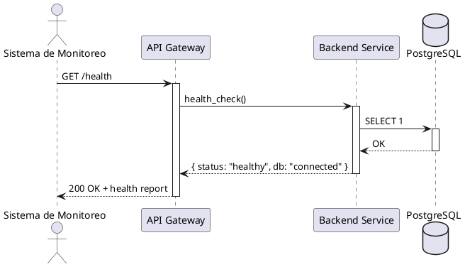
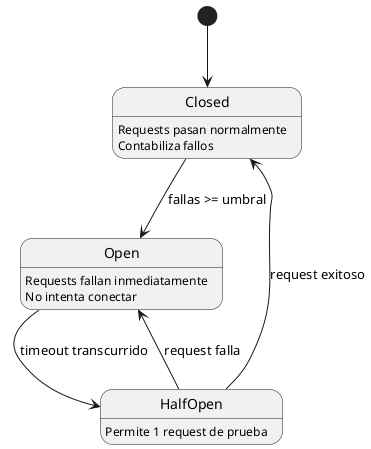
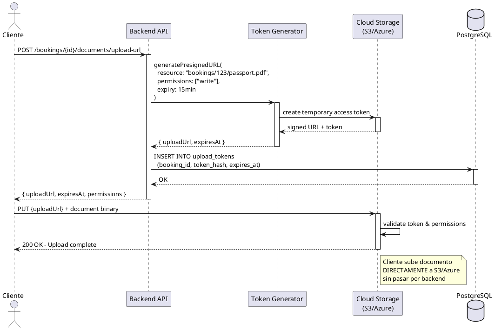
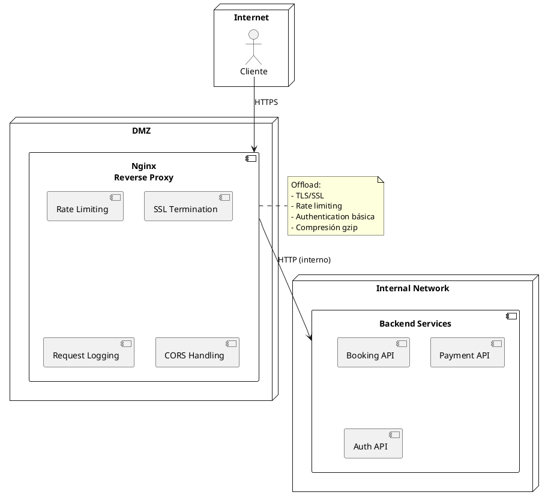
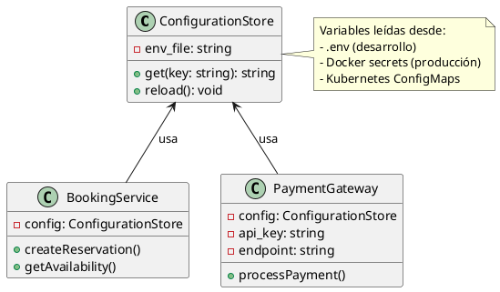

# Unidad 4 — Patrones de Arquitectura

Fecha: 29 de octubre de 2025

Autores: Francisco Lima, Nicolás Márquez, Martina Guzmán

Repositorio: https://github.com/Marz270/proyecto_hotel_casino

---

Este documento reúne la Sección 4 (Patrones de arquitectura) del Trabajo Final de Unidad 4. Contiene los patrones implementados en el proyecto Salto Hotel & Casino API, diagramas PlantUML, justificaciones, relación con las tácticas definidas en la unidad anterior y scripts de demostración.

## Resumen ejecutivo

Se han seleccionado e implementado siete patrones (cubriendo disponibilidad, rendimiento, seguridad y facilidad de modificación/despliegue) para demostrar cómo se satisfacen los Requerimientos No Funcionales (RNF) del sistema. Los patrones documentados incluyen:

- Health Endpoint Monitoring (Disponibilidad)
- Circuit Breaker (Disponibilidad)
- Valet Key (Seguridad)
- Cache-Aside (Rendimiento)
- Competing Consumers (Rendimiento)
- Gateway Offloading (Seguridad)
- External Configuration Store (Facilidad de modificación / despliegue)

Cada patrón incluye: diagrama (PlantUML), justificación, beneficios y notas sobre la implementación en el código del repositorio.

---

## 1. Health Endpoint Monitoring (Disponibilidad)

Diagrama de secuencia (PlantUML):



Justificación y beneficios:

- Detección proactiva de fallos de infraestructura y dependencias (BD, colas, servicios externos).
- Permite activar alertas, orquestar rollback o failover automático.

Implementación (resumen): endpoint `/health` en el backend que realiza: comprobación simple a PostgreSQL, chequeo de memoria y estado de recursos críticos. Devuelve 200 cuando todo está OK o 503 si hay fallo.

---

## 2. Circuit Breaker (Disponibilidad)

Diagrama de estados (PlantUML):



Justificación:

- Protege al sistema de degradación por fallos continuos en dependencias externas (ej.: pasarela de pagos).
- Reduce latencia y consumo de recursos cuando la dependencia está caída.

Notas de implementación:

- Umbral: 5 fallos consecutivos → abrir por 60s. En Half-Open permite 1 request de prueba.
- Se puede usar una librería (por ejemplo `opossum` en Node.js) o una implementación simple en middleware.

---

## 3. Valet Key (Seguridad)

Diagrama de secuencia (PlantUML):



Justificación:

- En un hotel-casino, los huéspedes deben subir documentos sensibles (pasaportes, comprobantes de pago, identificaciones requeridas por regulación de juegos de azar).
- El patrón Valet Key permite que el cliente suba archivos directamente al almacenamiento cloud sin que pasen por el backend, reduciendo la superficie de ataque y cumpliendo con normativas de protección de datos.
- Tokens con permisos granulares y expiración automática (15 minutos) garantizan seguridad sin comprometer la experiencia del usuario.

Beneficios en el proyecto:

- **Seguridad mejorada**: Backend nunca toca archivos sensibles, evitando ataques de file injection o path traversal.
- **Rendimiento**: Libera recursos del servidor al no procesar binarios grandes (uploads paralelos, sin timeouts).
- **Cumplimiento regulatorio**: Logs de auditoría en S3, encriptación en tránsito y reposo, trazabilidad completa para auditorías del casino.
- **Escalabilidad**: Backend maneja 1000+ solicitudes/seg de tokens, mientras S3/Azure escala automáticamente para uploads concurrentes.

Notas de implementación:

- Usar un sidecar o servicio que genere tokens firmados con HMAC-SHA256.
- Integrar con AWS S3 presigned URLs o Azure Blob SAS tokens en producción.
- Almacenar hash del token en PostgreSQL para validación y auditoría.
- Implementar cleanup automático de tokens expirados con triggers de BD.

---

## 4. Cache-Aside (Rendimiento)

Diagrama de secuencia (PlantUML):

```plantuml
@startuml
actor Cliente
participant "API" as API
participant "Cache\n(Redis)" as Cache
database "PostgreSQL" as DB

Cliente -> API: GET /rooms/availability
activate API

API -> Cache: get("rooms:YYYY-MM")
activate Cache

alt Cache HIT
    Cache --> API: [habitaciones disponibles]
    API --> Cliente: 200 OK (cached)
else Cache MISS
    Cache --> API: null
    deactivate Cache

    API -> DB: SELECT * FROM rooms WHERE...
    activate DB
    DB --> API: [datos frescos]
    deactivate DB

    API -> Cache: set("rooms:YYYY-MM", data, TTL=300s)
    activate Cache
    Cache --> API: OK
    deactivate Cache

    API --> Cliente: 200 OK (from DB)
endif

deactivate API
@enduml
```

Justificación:

- Las consultas de disponibilidad son frecuentes y la información no cambia cada segundo.
- Redis como cache reduce latencia y alivia la base de datos.

Notas de implementación:

- TTL sugerido: 300s (5 minutos). Al crear/cancelar reserva se invalida o actualiza la clave correspondiente.

---

## 5. Competing Consumers (Rendimiento)

Diagrama (PlantUML simple de componentes):

```plantuml
@startuml
component "Message Queue\n(RabbitMQ)" as Queue {
  queue "email-notifications" as EmailQ
}

component "Consumer Pool" {
  [Email Worker 1] as EW1
  [Email Worker 2] as EW2
  [Email Worker 3] as EW3
}

component "Booking Service" as Booking

Booking --> EmailQ: publish notification
EmailQ --> EW1: consume
EmailQ --> EW2: consume
EmailQ --> EW3: consume

note right of Consumer Pool
  Escalado horizontal
  según carga de mensajes
end note
@enduml
```

Justificación:

- Evita bloquear el flujo principal de reservas por operaciones I/O lentas (envío de correos, notificaciones).
- Workers independientes procesan la cola, permitiendo escalar según demanda.

Notas de implementación:

- RabbitMQ (o similar). La cola `email-notifications` con ACK y requeue en fallo.

---

## 6. Gateway Offloading (Seguridad)

Diagrama de despliegue (PlantUML):



Justificación:

- Centraliza funciones transversales: TLS, límites por IP, logs, cabeceras de seguridad.
- Reduce complejidad y carga en los servicios backend.

Implementación (en el repo):

- `nginx/nginx.conf` y `nginx/nginx.rollback.conf` proporcionan la configuración de proxy, TLS y rate limiting.

---

## 7. External Configuration Store (Facilidad de modificación / despliegue)

Diagrama de clases (PlantUML):



Justificación:

- Evita rebuilds para cambios de configuración. Facilita toggles (ej.: `BOOKING_MODE=mock|pg`).
- Permite despliegues canary y pruebas A/B variando únicamente configuración.

Implementación aplicada:

- El repo ya incluye soporte para la variable `BOOKING_MODE` y scripts de despliegue/rollback (`deploy-v2.sh`, `rollback.sh`).

---

## Relación con tácticas de arquitectura (TFU2)

- **Rollback**: `Health Endpoint Monitoring` y `Gateway Offloading` permiten detectar regressions y activar scripts de rollback automáticos si la versión desplegada presenta salud degradada.
- **Diferir Binding**: `External Configuration Store` y la variable `BOOKING_MODE` permiten alternar entre `bookingService.mock.js` y `bookingService.pg.js` sin tocar el código.
- **Defensa en profundidad**: `Gateway Offloading` (Nginx) + `Valet Key` (tokens temporales) + validación con `express-validator` ofrecen capas defensivas para proteger contra inputs maliciosos, ataques de denegación y acceso no autorizado a recursos.
- **Alta disponibilidad**: `Circuit Breaker` junto con health checks previenen cascadas de fallos y mantienen el sistema operativo ante degradación de servicios externos.
- **Limit Access (Seguridad)**: `Valet Key` implementa el principio de mínimo privilegio otorgando permisos temporales y específicos (upload/download) solo para recursos autorizados, complementando la autenticación JWT y autorización por roles.

---

## Fragmentos de código y rutas relevantes

- Health check: `backend/patterns/health/healthCheck.js` (o implementación inline en `server.js`).
- Circuit Breaker: `backend/patterns/circuit-breaker/paymentCircuitBreaker.js` (sugerido usar `opossum` o similar).
- **Valet Key**: `backend/patterns/valet-key/valetKeyGenerator.js` (generación de tokens firmados), `backend/routes/documents.routes.js` (endpoints de upload/download), `backend/database/scripts/003_create_upload_tokens_table.sql` (tabla de auditoría).
- Cache-Aside: integración con Redis (sugerido archivo `backend/patterns/cache/cacheAside.js`).
- Queues / Competing Consumers: `backend/patterns/queue/` y workers en `backend/services/workers/`.

Nota: los nombres de archivo anteriores son recomendaciones de organización; el repositorio actual ya contiene `backend/services/bookingService.mock.js`, `backend/services/bookingService.pg.js` y `backend/services/bookingServiceFactory.js` que ejemplifican la táctica de Diferir Binding.

---

## Scripts de demostración (resumen)

### Demo Valet Key (upload seguro de documentos):

PowerShell:

```powershell
# Paso 1: Crear una reserva de prueba
$booking = curl -X POST http://localhost:3000/bookings -H "Content-Type: application/json" -d '{
  "client_name": "Juan Pérez",
  "room_number": 205,
  "check_in": "2025-11-05",
  "check_out": "2025-11-08",
  "total_price": 450.00
}' | ConvertFrom-Json

$bookingId = $booking.id
Write-Host "✅ Reserva creada: ID = $bookingId"

# Paso 2: Solicitar token temporal para subir pasaporte
$tokenResponse = curl -X POST "http://localhost:3000/bookings/$bookingId/documents/request-upload" -H "Content-Type: application/json" -d '{"documentType": "passport"}' | ConvertFrom-Json

Write-Host "🎫 Token generado - Expira: $($tokenResponse.expiresAt)"
Write-Host "📤 Upload URL: $($tokenResponse.uploadUrl)"

# Paso 3: Subir documento usando el token (simulado)
$uploadUrl = $tokenResponse.uploadUrl
"Test passport content" | Out-File -FilePath "C:\temp\passport_demo.pdf"

$uploadResult = curl -X PUT $uploadUrl -F "file=@C:\temp\passport_demo.pdf" | ConvertFrom-Json

Write-Host "✅ Documento subido: $($uploadResult.file.filename) ($($uploadResult.file.size) bytes)"

# Paso 4: Verificar seguridad - Intentar reusar token (debería fallar)
Write-Host "🚫 Intentando reusar token..."
try {
  curl -X PUT $uploadUrl -F "file=@C:\temp\passport_demo.pdf" 2>&1 | Out-Null
  Write-Host "❌ ERROR: Token reusado (no debería permitirse)"
} catch {
  Write-Host "✅ Token rechazado correctamente (single-use o expirado)"
}
```

### Demo Circuit Breaker (simular fallo pasarela de pagos):

PowerShell:

```powershell
# Parar servicio de pagos simulado
docker-compose stop payment-gateway

# Enviar varias peticiones de pago
for ($i=0; $i -lt 10; $i++) {
  curl -X POST http://localhost:3000/payments -H "Content-Type: application/json" -d '{"amount":100, "booking_id":1}'
  Write-Host ""
}
```

### Demo Cache-Aside:

PowerShell:

```powershell
Write-Host "Primera consulta (cache MISS)"
Measure-Command { curl http://localhost:3000/rooms/availability?month=2025-09 }

Write-Host "Segunda consulta (cache HIT)"
Measure-Command { curl http://localhost:3000/rooms/availability?month=2025-09 }
```

---

## Cómo usar este README en la entrega

1. Asegúrate de que tu entorno Docker esté activo.
2. Desde la raíz del proyecto ejecuta (PowerShell):

```powershell
.\deploy.ps1
# o
.\deploy.sh
```

3. Verifica la API:

```powershell
curl http://localhost:3000/health
curl http://localhost:3000/bookings
```

4. Para probar Diferir Binding (modo mock):

```powershell
.\set-booking-mode-final.ps1 -Mode mock
docker-compose up -d --force-recreate backend_v1
curl http://localhost:3000/bookings
```

5. Para demo de rollback:

```powershell
./deploy-v2.sh
./rollback.sh
```

---

## Notas finales

Este README resume las decisiones de diseño y la implementación de los patrones solicitados en la unidad 4. Si deseas, puedo:

- Generar los archivos PlantUML (.puml) separados para cada diagrama y añadirlos al repositorio.
- Implementar ejemplos listos a usar (ej.: `backend/patterns/health/healthCheck.js`, integración Redis, o un worker de RabbitMQ).
- Crear un pequeño script de pruebas automatizadas que demuestre los efectos (latencia con/ sin cache, comportamiento del circuit breaker, etc.).

---

Archivo creado automáticamente: `README_U4_PATRONES_v2.md`
