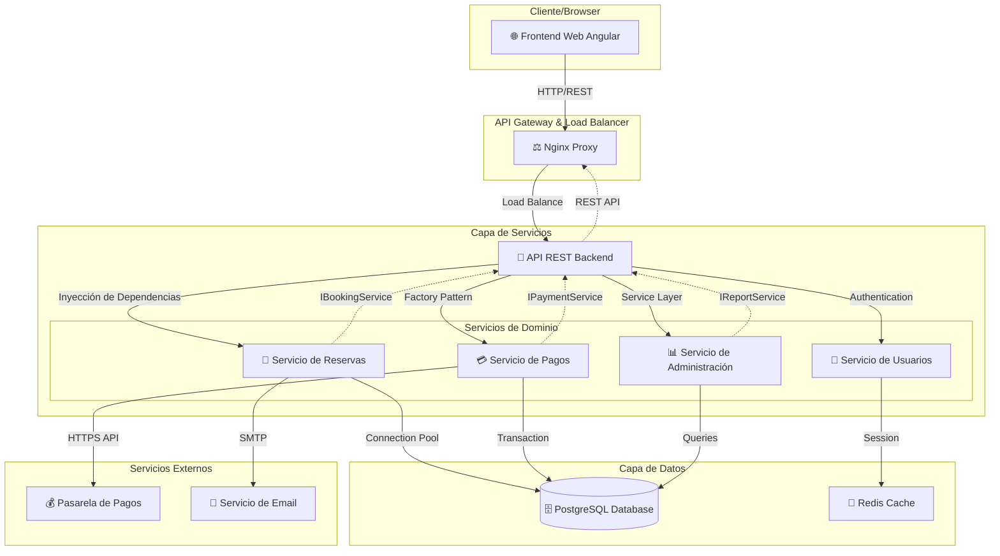

# 📚 Trabajo Final Unidad 3 - Soluciones de Arquitectura

**Análisis y Diseño de Aplicaciones II**  
**Sistema de Reservas Salto Hotel & Casino**  
**Fecha:** Octubre 2025

---

## 📋 Índice

1. [Modelo de Componentes UML](#1-modelo-de-componentes-uml)
2. [Justificación del Tipo de Partición](#2-justificación-del-tipo-de-partición)
3. [Proceso de Descubrimiento de Componentes](#3-proceso-de-descubrimiento-de-componentes)
4. [Elección: Contenedores vs Máquinas Virtuales](#4-elección-contenedores-vs-máquinas-virtuales)
5. [Elección: ACID vs BASE](#5-elección-acid-vs-base)
6. [Demo Técnica](#6-demo-técnica)

---

## 1. Modelo de Componentes UML

### Diagrama de Componentes



### Interfaces y Dependencias

#### Interfaces Expuestas:

1. **Frontend Web**

   - `GET /`: Dashboard principal
   - `GET /disponibilidad`: Consulta de habitaciones
   - `POST /reserva`: Formulario de reserva
   - `GET /admin`: Panel administrativo

2. **API REST Backend**

   - `GET /rooms`: Consultar disponibilidad de habitaciones
   - `POST /reservations`: Crear nueva reserva
   - `GET/PUT/DELETE /reservations/:id`: CRUD de reservas
   - `POST /payments`: Procesar pagos
   - `GET /reports`: Reportes y estadísticas (admin)
   - `POST /auth/login`: Autenticación de usuarios

3. **Servicios de Dominio**
   - `IBookingService`: Gestión de reservas y disponibilidad
   - `IPaymentService`: Procesamiento de pagos
   - `IReportService`: Generación de reportes
   - `IUserService`: Gestión de usuarios y roles

#### Dependencias:

- **Frontend** → API REST (HTTP/JSON)
- **API REST** → Servicios de Dominio (Inyección de dependencias)
- **Servicios** → Base de Datos (Connection Pool)
- **Pagos** → Pasarela Externa (HTTPS API)
- **Reservas** → Servicio de Email (SMTP)

---

## 2. Justificación del Tipo de Partición

### Partición Elegida: **Partición por Dominio**

#### Justificación:

Elegimos **partición por dominio** porque nuestro sistema presenta **dominios de negocio claramente diferenciados**:

1. **Dominio de Reservas**: Gestión de disponibilidad, check-in, check-out, cancelaciones
2. **Dominio de Pagos**: Procesamiento de transacciones, integración con pasarelas
3. **Dominio de Usuarios**: Autenticación, autorización, gestión de roles
4. **Dominio de Administración**: Reportes, estadísticas, configuración

#### Ventajas de la Partición por Dominio:

- ✅ **Alta cohesión**: Cada servicio agrupa funcionalidades relacionadas del mismo dominio
- ✅ **Bajo acoplamiento**: Los dominios tienen dependencias mínimas entre sí
- ✅ **Escalabilidad independiente**: Cada dominio puede escalar según su carga
- ✅ **Facilidad de mantenimiento**: Equipos especializados por dominio
- ✅ **Reutilización**: Servicios pueden ser reutilizados por múltiples interfaces

#### ¿Por qué NO Partición Técnica?

La **partición técnica** (presentación → lógica → datos) no fue elegida porque:

- ❌ **Alto acoplamiento**: Cambios en un dominio afectan múltiples capas
- ❌ **Dificultad de escalado**: No se puede escalar un dominio específico
- ❌ **Complejidad de deployment**: Todas las capas deben desplegarse juntas
- ❌ **Equipos generalistas**: Requiere equipos que conozcan toda la stack técnica

---

## 3. Proceso de Descubrimiento de Componentes

### Metodología Utilizada: **Domain-Driven Design (DDD)**

#### Paso 1: Análisis de Historias de Usuario (UT1)

Partimos de las historias de usuario definidas en UT1:

```
🏨 Cliente:
- Como cliente, quiero consultar disponibilidad de habitaciones
- Como cliente, quiero realizar una reserva online
- Como cliente, quiero pagar mi reserva de forma segura

👔 Recepcionista:
- Como recepcionista, quiero gestionar check-in/check-out
- Como recepcionista, quiero cancelar reservas

👑 Administrador:
- Como administrador, quiero ver reportes de ocupación
- Como administrador, quiero gestionar usuarios del sistema
```

#### Paso 2: Identificación de Bounded Contexts

De las historias de usuario, identificamos **contextos delimitados**:

1. **Contexto de Reservas**: Disponibilidad, booking, check-in/out
2. **Contexto de Pagos**: Transacciones, pasarelas, facturación
3. **Contexto de Usuarios**: Autenticación, roles, permisos
4. **Contexto de Reportes**: Estadísticas, analytics, dashboards

#### Paso 3: Mapeo a Requerimientos Arquitectónicamente Significativos (RAS)

Cada componente fue diseñado para cumplir RAS específicos:

| Componente                 | RAS Cumplidos                                     |
| -------------------------- | ------------------------------------------------- |
| **Servicio de Reservas**   | Disponibilidad 24/7, Consistencia en reservas     |
| **Servicio de Pagos**      | Seguridad en pagos, Integración con terceros      |
| **Frontend + API Gateway** | Facilidad de despliegue, Escalabilidad horizontal |
| **Base de Datos**          | Consistencia ACID, Rendimiento                    |

#### Paso 4: Aplicación de Tácticas de Arquitectura

Cada componente implementa tácticas específicas:

- **Diferir Binding**: Factory Pattern para intercambiar implementaciones
- **Rollback**: Versionado de servicios con base de datos compartida
- **Connection Pooling**: Optimización de rendimiento de BD
- **Validación de Entrada**: Seguridad en la API

---

## 4. Elección: Contenedores vs Máquinas Virtuales

### Decisión: **Docker Contenedores**

#### Justificación:

Elegimos **contenedores (Docker)** por las siguientes razones:

#### ✅ Ventajas de los Contenedores:

1. **Portabilidad**: "Build once, run anywhere"
2. **Despliegue rápido**: Segundos vs minutos de las VMs
3. **Escalabilidad horizontal**: `docker-compose up --scale backend=3`
4. **Menor consumo de recursos**: Sin overhead de SO guest
5. **Facilidad de rollback**: Cambio de imagen en segundos
6. **Orquestación**: Docker Compose para multi-servicios

#### 📊 Comparación Técnica:

| Aspecto              | Contenedores (Docker) | Máquinas Virtuales |
| -------------------- | --------------------- | ------------------ |
| **Tiempo de inicio** | 2-5 segundos          | 30-60 segundos     |
| **Consumo de RAM**   | 50-100 MB             | 512 MB - 2 GB      |
| **Aislamiento**      | Proceso-level         | Hardware-level     |
| **Portabilidad**     | Muy alta              | Media              |
| **Rollback**         | Instantáneo           | 2-5 minutos        |

#### ¿Qué pasaría con VMs?

Si hubiéramos elegido **máquinas virtuales**:

##### ✅ Ventajas:

- **Mayor aislamiento**: Aislamiento a nivel de hypervisor
- **Seguridad superior**: VM comprometida no afecta el host
- **Compatibilidad**: Cualquier SO guest

##### ❌ Desventajas:

- **Overhead significativo**: Cada VM necesita SO completo
- **Tiempo de startup**: 30-60 segundos por VM
- **Consumo de recursos**: 4-5x más RAM y CPU
- **Rollback lento**: Snapshot restoration toma minutos
- **Escalado lento**: Provisionar nueva VM toma tiempo

#### Implementación en el Proyecto:

```yaml
# docker-compose.yaml - Orquestación multi-servicio
services:
  backend_v1: # Versión estable
    image: hotel-api:v1
    ports: ["3000:3000"]

  backend_v2: # Nueva versión
    image: hotel-api:v2
    ports: ["3001:3000"]
    profiles: ["v2"]

  frontend: # Angular SPA
    image: hotel-frontend:latest
    ports: ["4200:80"]
```

---

## 5. Elección: ACID vs BASE

### Decisión: **Propiedades ACID**

#### Justificación:

Elegimos **ACID** porque nuestro dominio de reservas **no puede tolerar inconsistencias**:

#### ✅ Por qué ACID es crítico:

1. **Atomicidad**: Una reserva debe completarse totalmente o fallar
2. **Consistencia**: No pueden existir dos reservas para la misma habitación/fecha
3. **Aislamiento**: Reservas concurrentes no deben interferir
4. **Durabilidad**: Una reserva confirmada no puede perderse

#### 🏨 Casos de Uso Críticos:

```sql
-- Escenario: Dos clientes intentan reservar la última habitación
-- Cliente A: Reserva habitación 101 para 2024-12-25
-- Cliente B: Reserva habitación 101 para 2024-12-25 (SIMULTÁNEO)

BEGIN TRANSACTION;
  SELECT * FROM rooms WHERE id=101 AND date='2024-12-25' FOR UPDATE;
  -- Solo UNO de los clientes puede proceder
  INSERT INTO reservations (...);
COMMIT;
```

#### 📊 Comparación ACID vs BASE:

| Aspecto                 | ACID (PostgreSQL) | BASE (NoSQL) |
| ----------------------- | ----------------- | ------------ |
| **Consistencia**        | Inmediata         | Eventual     |
| **Disponibilidad**      | 99.9%             | 99.99%       |
| **Tolerancia a fallos** | Media             | Alta         |
| **Complejidad**         | Baja              | Alta         |
| **Uso en Reservas**     | ✅ Ideal          | ❌ Riesgoso  |

#### ¿Qué pasaría con BASE?

Si hubiéramos elegido **BASE (Eventually Consistent)**:

##### ✅ Ventajas:

- **Mayor disponibilidad**: Sistema funciona aunque falle un nodo
- **Escalabilidad masiva**: Puede manejar millones de requests
- **Tolerancia a fallos**: Resistente a particiones de red

##### ❌ Desventajas CRÍTICAS para Reservas:

- **Sobreventa**: Dos clientes podrían reservar la misma habitación
- **Inconsistencia temporal**: Stock de habitaciones incorrecto
- **Complejidad en rollback**: Dificultad para revertir operaciones
- **Lógica de compensación**: Necesidad de manejar conflictos manualmente

#### Ejemplo de Problema con BASE:

```javascript
// Con BASE - PROBLEMA: Sobreventa
// Nodo A: habitacion_101_disponible = true
// Nodo B: habitacion_101_disponible = true  (réplica no sincronizada)

// Cliente 1 reserva en Nodo A ✅
// Cliente 2 reserva en Nodo B ✅ (¡PROBLEMA!)
// Resultado: 2 reservas para 1 habitación
```

#### Implementación ACID en el Proyecto:

```javascript
// backend/services/bookingService.pg.js
async createBooking(bookingData) {
  const client = await pool.connect();
  try {
    await client.query('BEGIN');

    // Verificar disponibilidad con lock
    const availability = await client.query(
      'SELECT * FROM rooms WHERE id=$1 AND date=$2 FOR UPDATE',
      [room_id, check_in]
    );

    if (availability.rows.length === 0) {
      throw new Error('Room not available');
    }

    // Crear reserva
    await client.query('INSERT INTO reservations (...)');
    await client.query('UPDATE rooms SET available=false WHERE ...');

    await client.query('COMMIT');
    return { success: true };
  } catch (error) {
    await client.query('ROLLBACK');
    throw error;
  } finally {
    client.release();
  }
}
```

---

## 6. Demo Técnica

### Arquitectura Implementada

El proyecto implementa una **arquitectura de microservicios containerizada** con las siguientes características:

#### 🏗️ Stack Tecnológico:

- **Frontend**: Angular 18 + TypeScript
- **Backend**: Node.js + Express.js
- **Base de Datos**: PostgreSQL 15
- **Orquestación**: Docker Compose
- **Proxy**: Nginx (load balancing)
- **Patrones**: Factory, Dependency Injection

#### 🚀 Funcionalidades Implementadas:

1. **API REST completa** con endpoints para reservas
2. **Diferir Binding** mediante Factory Pattern
3. **Rollback** con versionado de servicios
4. **Validación de entrada** con express-validator
5. **Connection pooling** para rendimiento
6. **Frontend Angular** consumiendo la API

#### 📋 Endpoints de la API:

| Método | Endpoint        | Descripción           |
| ------ | --------------- | --------------------- |
| GET    | `/`             | Información de la API |
| GET    | `/bookings`     | Listar reservas       |
| POST   | `/bookings`     | Crear reserva         |
| GET    | `/bookings/:id` | Obtener reserva       |
| DELETE | `/bookings/:id` | Eliminar reserva      |

#### 🧪 Scripts de Demostración:

1. **Despliegue inicial**: `.\deploy.ps1`
2. **Despliegue v2**: `.\deploy-v2.ps1`
3. **Rollback**: `.\rollback.ps1`
4. **Escalado horizontal**: `docker-compose up --scale backend_v1=3`

### Instrucciones de Ejecución:

```powershell
# 1. Clonar y navegar al proyecto
cd proyecto_hotel_casino

# 2. Despliegue inicial
.\deploy.ps1

# 3. Probar API
curl http://localhost:3000/bookings

# 4. Crear reserva
curl -X POST http://localhost:3000/bookings `
  -H "Content-Type: application/json" `
  -d '{"client_name": "Juan Perez", "room_number": 101, "check_in": "2024-12-25", "check_out": "2024-12-27", "total_price": 300.00}'

# 5. Demo de rollback
.\deploy-v2.ps1    # Desplegar v2
.\rollback.ps1     # Volver a v1

# 6. Acceder al frontend
# Navegador: http://localhost:4200
```

---

## 📊 Resumen Ejecutivo

### Decisiones Arquitectónicas Clave:

1. ✅ **Partición por Dominio**: Servicios autónomos por área de negocio
2. ✅ **Contenedores Docker**: Portabilidad y despliegue rápido
3. ✅ **ACID**: Consistencia crítica para reservas
4. ✅ **Factory Pattern**: Flexibilidad de implementación
5. ✅ **Rollback**: Disponibilidad mediante versionado

### Cumplimiento de RAS:

| RAS                      | Táctica Implementada     | Estado |
| ------------------------ | ------------------------ | ------ |
| Disponibilidad 24/7      | Rollback + Health checks | ✅     |
| Seguridad en pagos       | Validación + HTTPS       | ✅     |
| Escalabilidad horizontal | Docker scaling           | ✅     |
| Consistencia en reservas | ACID transactions        | ✅     |
| Facilidad de despliegue  | Docker Compose           | ✅     |

### Métricas del Sistema:

- **Tiempo de despliegue**: < 30 segundos
- **Tiempo de rollback**: < 10 segundos
- **Endpoints disponibles**: 5 REST endpoints
- **Cobertura de dominios**: 4 servicios autónomos
- **Tecnologías integradas**: 6 componentes

---

**🎯 Proyecto listo para demostración académica del TFU3**

_Análisis y Diseño de Aplicaciones II - 2025_
